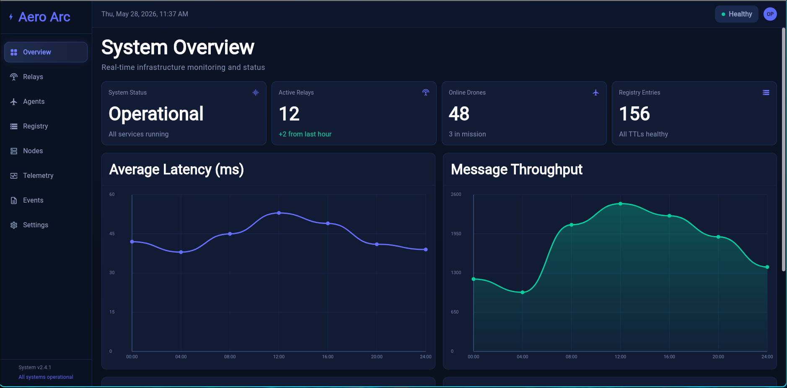

# Aero Arc Ops

Aero Arc Ops is a Flutter operations dashboard for monitoring distributed aerial infrastructure. The app presents a command-center view of relay health, agent activity, service registration, compute node utilization, and live telemetry in a responsive dark interface.



## Goal

Provide operators with a fast, readable surface for understanding whether the Aero Arc network is healthy and where attention is needed. The primary readiness, aircraft, operations, preflight, conformance, maintenance, records, intent, and aircraft-map views consume typed Aero Arc API read models.

## Current Functionality

- **Responsive shell** with desktop sidebar navigation and a mobile drawer.
- **System overview** with status cards, latency and throughput charts, node heartbeats, and recent events.
- **Relay monitoring** with relay counts, health states, node counts, regions, message rates, and heartbeat freshness.
- **Aircraft fleet view** with durable identity, readiness, active intent, registry placement, and telemetry recency.
- **Live operations view** with connected/stale/offline/unmapped state and independently timestamped position, battery, vehicle, system, HUD, extended-state, and GPS samples.
- **Live conformance view** with assignment condition, monitoring freshness,
  recording durability, active findings, evaluated axes, and evaluation/frame
  provenance read from Registry through the API.
- **Aircraft map** that combines replay, authorized operational volumes, an
  intent-bound validated mission plan, conformance evidence, and a one-second live
  tracker. Violet authorization, cyan mission waypoints, green observed flight,
  and the amber ten-second motion projection remain separate map layers.
- **Compute nodes** with CPU, memory, disk, region, uptime, and per-node utilization bars.
- **Telemetry dashboard** with latency, throughput, error rate, uptime, trend charts, system health radar, and fleet activity.
- **Events and settings placeholders** for timeline review and environment configuration workflows.

## Tech Stack

- Flutter 3.41+
- Dart 3.11+
- Material 3
- Custom `CustomPainter` charts
- Multi-platform Flutter project targets: web, Android, iOS, macOS, Linux, and Windows

## Quick Start

```sh
flutter pub get
flutter run -d chrome --dart-define=AERO_ARC_API_BASE_URL=http://localhost:8080
```

For WSL or another environment where Flutter cannot launch Chrome directly,
start the web server and open `http://localhost:7357` in your browser:

```sh
make web
```

Override the defaults when needed, for example:

```sh
make web WEB_PORT=8081 API_BASE_URL=http://localhost:8080
```

Mission deployment additionally requires a local development credential:

```sh
make web MISSION_DEPLOY_TOKEN=replace-with-a-local-token-at-least-24-bytes
```

That value is compiled into the web application and is therefore only a local
development bridge. It must not be used as production operator authentication;
production deployment controls require user-scoped API sessions.

For another target, replace `chrome` with an available device from:

```sh
flutter devices
```

## Verify

Run the local checks before pushing changes:

```sh
flutter analyze
flutter test
flutter build web --release
```

## Project Layout

```text
lib/
  api/
    aero_arc_api.dart        # Typed HTTP client and configurable API origin
  models/
    aero_arc_models.dart     # Workflow and dashboard read models
    live_aircraft_state.dart # Registry plus independent telemetry groups
  main.dart                  # App shell, theme, routing, responsive navigation
  pages/
    overview_page.dart       # System status, charts, heartbeats, event summary
    relays_page.dart         # Relay health and operational status
    agents_page.dart         # Agent fleet table and mission state
    registry_page.dart       # Live Operations and intent posture
    aircraft_map_screen.dart # Live state, replay, intent, and conformance map
    nodes_page.dart          # Compute node health and utilization
    telemetry_page.dart      # Performance metrics and custom charts
    events_page.dart         # Events placeholder
    settings_page.dart       # Settings placeholder
  widgets/
    section_page.dart        # Shared placeholder page layout
```

## Live aircraft data contract

The Operations page reads `live_aircraft` from `GET /api/v1/operations` so a
fleet refresh is a single API request. Aircraft detail reads
`GET /api/v1/aircraft/{aircraft_id}/state` alongside the existing map endpoint.

Registry status and telemetry status are intentionally distinct. Every MAVLink
group retains its own `recorded_at` and `fresh`/`stale` status; missing groups
remain missing rather than being filled from an unrelated message. The UI uses
the API's configured freshness classification and shows each group's sample
age. See `test/fixtures/live_aircraft_state.json` for an executable example.

If the live-state request fails, the aircraft map continues to render durable
aircraft, replay, intent, volume, and conformance data with an explicit
unavailable state.

## Live conformance data contract

Operations and Conformance consume the API's Registry-backed projections. The
condition (`conforming`, `suspected`, or `non_conforming`), monitoring status,
and recording status are separate signals and are displayed independently. A
clear evaluated axis is evidence that a check ran; it is not an active finding.
The client does not invent freshness or conformance thresholds.

The Conformance page refreshes the batch dashboard every three seconds. Its
`Evaluate API sample` action is an explicit legacy/single-sample diagnostic;
normal live results are produced by Agent telemetry flowing through Relay,
Conformance, and Registry. Missing optional live fields degrade locally without
hiding durable conformance history.

The diagnostic action is hidden in normal builds. Enable it only for a local
diagnostic session with
`--dart-define=AERO_ARC_ENABLE_SAMPLE_CONFORMANCE=true`; submitted samples are
persisted and can create conformance findings.

## No-seed SITL observer stack

The repository includes a local WSL-oriented runner for watching one real
ArduCopter SITL instance through the full observation path. It builds sibling
Aero Arc repositories, starts isolated PostGIS and InfluxDB containers, starts
Registry, Relay, Conformance, API, Agent, Ops, and SITL, and then creates the
aircraft, battery installation, intent, volume, and flight through API routes.
API and Conformance use separate logical databases in the same PostGIS
instance, so their migrations remain isolated while API mission and flight
state exercises the durable PostgreSQL implementation. It does not load
fixture or seed data.

Prerequisites are Docker Compose, Flutter, Go, OpenSSL, tmux, and an existing
ArduPilot checkout with a built `ArduCopter` SITL binary. With the Aero Arc
repositories and `ardupilot` checked out beside this repository, run:

```sh
make sitl-up
make sitl-status
```

Open `http://localhost:7357`. `sitl-up` activates a ten-minute plan and gives
Conformance a separate 24-hour monitoring authority. Crossing the planned end
therefore produces an overdue temporal-deviation state; it does not silently
stop monitoring or mark the flight complete. Override these windows with
`AERO_ARC_SITL_PLAN_MINUTES` and `AERO_ARC_SITL_MONITOR_HOURS`.

`sitl-up` imports the checked-in WPL 110 demonstration mission and validates
every waypoint and complete route segment against the exact intent version. It
then asks only the API to deploy the current immutable mission. The API derives
the aircraft's Agent assignment, resolves that Agent's current Relay through
Registry, establishes the exact operation context, and sends the command over
mTLS. Neither Ops nor the observer chooses an Agent or Relay or resubmits
mission bytes. The Agent reports success only after an onboard readback matches
the API mission digest. Reconcile or retry the same durable command with:

```sh
make sitl-mission-deploy
```

Ops presents mission validation and durable aircraft-deployment status as
separate steps. The map also keeps the authorization, validated plan, and
observed flight visually separate. Start the AUTO mission with:

```sh
make sitl-mission-run
```

Mission import is deliberately constrained to a single MSL Polygon volume and
the supported WPL 110 navigation commands. A mission cannot replace or reshape
the operational intent. `sitl-mission-run` configures SITL-only AUTO behavior,
selects AUTO in MAVProxy, waits until fresh API telemetry confirms that mode,
and sends ARM through the authenticated Relay/Agent command lifecycle. The
checked-in observer mission deliberately ends at an airborne waypoint rather
than LAND so the post-mission boundary checks remain possible; landing stays an
explicit operator action. The command plane also supports explicit ARM and
DISARM:

```sh
make sitl-arm
make sitl-disarm
```

Movement commands are still issued from MAVProxy. Start a takeoff and waypoint
demonstration, or attach to the interactive console:

```sh
make sitl-demo-flight
make sitl-console
```

While airborne, the repeatable post-window spatial check sends the aircraft
outside and then just back inside the authorized Polygon. This demonstrates
that lateral deviation can open and clear independently while the temporal
deviation remains open. These helpers wait for fresh armed/airborne telemetry
and API-confirmed GUIDED mode before sending a target, so calling them
immediately after `sitl-mission-run` is safe:

```sh
make sitl-out-of-bounds
make sitl-return-in-bounds
```

Land first, observe the landing/disarm, and only then complete the operational
lifecycle:

```sh
make sitl-land
make sitl-complete
make sitl-down
```

`sitl-complete` is deliberately explicit: it completes the API intent and
clears the matching Agent context, while the flight remains active if no
authoritative flight-completion signal has been implemented. Automatic
Agent-driven flight completion and broader guided movement commands remain
command-lifecycle work, not behavior simulated by this runner.

Source checkouts can be selected without editing the script, for example
`AERO_ARC_RELAY_SOURCE=/tmp/aero-arc-relay-mission make sitl-up`. The runner
fails before starting services when the selected Relay does not implement the
mission-deployment RPC. Its isolated Influx listener defaults to port `28181`
and can be changed with `AERO_ARC_SITL_INFLUX_PORT`. Runtime binaries,
certificates, WAL, logs, and PID files live under
`/tmp/aero-arc-sitl-observer` by default.

## Roadmap

- Add authenticated API sessions and role-aware controls.
- Add event filtering, severity grouping, and timeline drill-downs.
- Add relay and agent detail pages backed by registry read endpoints.
- Add golden tests for responsive dashboard layouts.

## Repository Notes

Generated build output, local editor files, Flutter tool caches, and machine-specific platform files are ignored. Source, platform scaffolding, assets, tests, and `pubspec.lock` are tracked so the app can be reproduced consistently.
